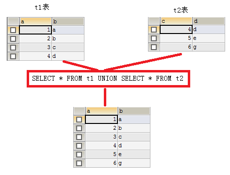
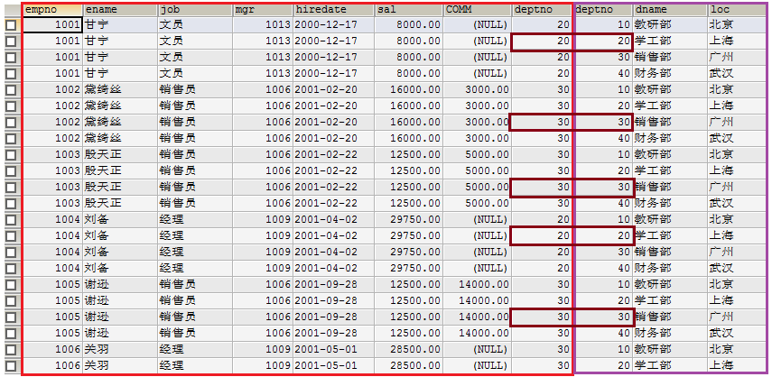
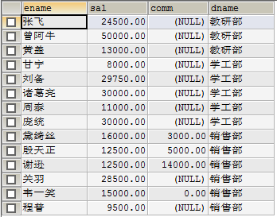
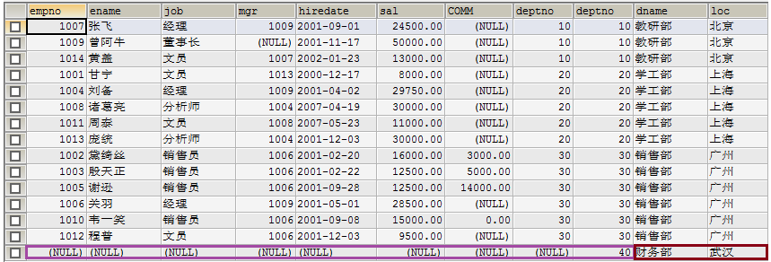
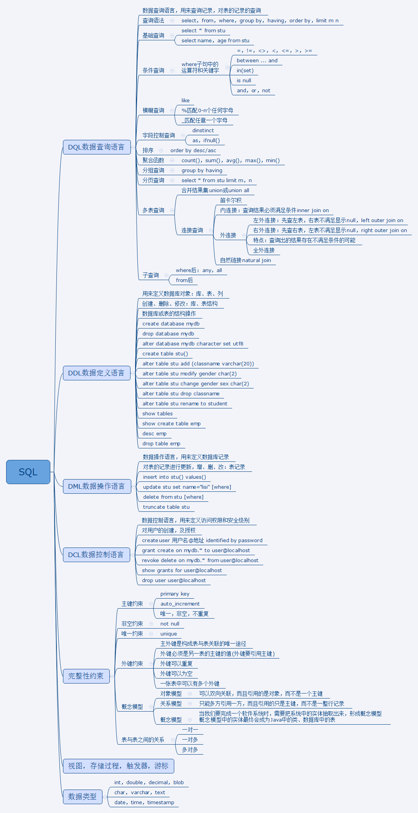

# MySql数据库系列阅读
1. [MySQL数据库](http://blog.csdn.net/axi295309066/article/details/52945641)
2. [MySQL数据库：SQL语句](http://blog.csdn.net/axi295309066/article/details/52945817)
3. [MySQL数据库：完整性约束](http://blog.csdn.net/axi295309066/article/details/52947798)
4. [MySQL数据库备份与还原](http://blog.csdn.net/axi295309066/article/details/52947851)
5. [MySQL数据库：编码](http://blog.csdn.net/axi295309066/article/details/52947876)

# 1. SQL概述
## **1.1 什么是SQL**

SQL（Structured Query Language）是“结构化查询语言”，它是对关系型数据库的操作语言。它可以应用到所有关系型数据库中，例如：MySQL、Oracle、SQL Server等。SQ标准（ANSI/ISO）有：

- SQL-92：1992年发布的SQL语言标准
- SQL:1999：1999年发布的SQL语言标签
- SQL:2003：2003年发布的SQL语言标签

这些标准就与JDK的版本一样，在新的版本中总要有一些语法的变化。不同时期的数据库对不同标准做了实现。

虽然SQL可以用在所有关系型数据库中，但很多数据库还都有标准之后的一些语法，我们可以称之为“方言”。例如MySQL中的LIMIT语句就是MySQL独有的方言，其它数据库都不支持！当然，Oracle或SQL Server都有自己的方言。

SQL的作用：客户端使用SQL来操作服务器

## **1.2 语法要求**

SQL标准(例如SQL99，即1999年制定的标准)：由国际标准化组织(ISO)制定的，对DBMS的统一操作方式(例如相同的语句可以操作：mysql、oracle等)。

SQL方言：某种DBMS不只会支持SQL标准，而且还会有一些自己独有的语法，这就称之为方言！例如limit语句只在MySQL中可以使用

SQL语法

- SQL语句可以单行或多行书写，以分号结尾
- 可以用空格和缩进来来增强语句的可读性
- 关键字不区别大小写，建议使用大写

# 2. 分类
- DDL（Data Definition Language）：数据定义语言，用来定义数据库对象：库、表、列等
- DML（Data Manipulation Language）：数据操作语言，用来定义数据库记录（数据）
- DCL（Data Control Language）：数据控制语言，用来定义访问权限和安全级别
- DQL（Data Query Language）：数据查询语言，用来查询记录（数据）

# 3. DDL：数据定义语言
## **3.1 基本操作**
- 查看所有数据库名称：SHOW DATABASES；　
- 切换数据库：USE mydb1，切换到mydb1数据库；

## **3.2 操作数据库**
- 创建数据库：CREATE DATABASE [IF NOT EXISTS] mydb1；

例如：CREATE DATABASE mydb1，创建一个名为mydb1的数据库。如果这个数据已经存在，那么会报错。例如CREATE DATABASE IF NOT EXISTS mydb1，在名为mydb1的数据库不存在时创建该库，这样可以避免报错

- 删除数据库：DROP DATABASE [IF EXISTS] mydb1；

例如：DROP DATABASE mydb1，删除名为mydb1的数据库。如果这个数据库不存在，那么会报错。DROP DATABASE IF EXISTS mydb1，就算mydb1不存在，也不会的报错

- 修改数据库编码：ALTER DATABASE mydb1 CHARACTER SET utf8；

修改数据库mydb1的编码为utf8。注意，在MySQL中所有的UTF-8编码都不能使用中间的“-”，即UTF-8要书写为UTF8

## **3.3 数据类型**
MySQL与Java一样，也有数据类型。MySQL中数据类型主要应用在列上。常用类型如下：

| 类型        | 说明                                       |
| :-------- | :--------------------------------------- |
| int       | 整型                                       |
| double    | 浮点型，例如double(5,2)表示最多5位，其中必须有2位小数，即最大值为999.99 |
| decimal   | 浮点型，在表单钱方面使用该类型，因为不会出现精度缺失问题             |
| char      | 固定长度字符串类型                                |
| varchar   | 可变长度字符串类型                                |
| text      | 字符串类型                                    |
| blob      | 字节类型                                     |
| date      | 日期类型，格式为：yyyy-MM-dd                      |
| time      | 时间类型，格式为：hh:mm:ss                        |
| timestamp | 时间戳类型                                    |

## **3.4 操作表**
创建表：
```mysql
CREATE TABLE 表名(
  列名 列类型,
  列名 列类型,
  ......
);
```
例如：
```sql
CREATE TABLE stu(
	sid	    CHAR(6),
	sname	VARCHAR(20),
	age		INT,
	gender	VARCHAR(10)
);
```
再例如：
```sql
CREATE TABLE emp(
	eid		CHAR(6),
	ename	VARCHAR(50),
	age		INT,
	gender	VARCHAR(6),
	birthday	DATE,
	hiredate	DATE,
	salary	DECIMAL(7,2),
	resume	VARCHAR(1000)
);
```

```mysql
SHOW TABLES; /*查看当前数据库中所有表名称*/

SHOW CREATE TABLE emp;/*查看emp表的创建语句*/

DESC emp; /*查看emp表结构*/

DROP TABLE emp;	/*删除emp表*/
```
修改表：add，modify，change，drop
```mysql
/*修改之添加列：给stu表添加classname列*/
ALTER TABLE stu ADD (classname varchar(100));

/*修改之修改列类型：修改stu表的gender列类型为CHAR(2)*/
ALTER TABLE stu MODIFY gender CHAR(2);

/*修改之修改列名：修改stu表的gender列名为sex*/
ALTER TABLE stu change gender sex CHAR(2);

/*修改之删除列：删除stu表的classname列*/
ALTER TABLE stu DROP classname;

/*修改之修改表名称：修改stu表名称为student*/
ALTER TABLE stu RENAME TO student;
```

# **4. DML：数据操作语言**
## **4.1 插入数据**
语法：INSERT INTO 表名(列名1,列名2, …) VALUES(值1, 值2)
```sql
INSERT INTO stu(sid, sname,age,gender) VALUES('s_1001', 'zhangSan', 23, 'male');
INSERT INTO stu(sid, sname) VALUES('s_1001', 'zhangSan');
```
因为没有插入age和gender列的数据，所以该条记录的age和gender值上为NULL

语法：INSERT INTO 表名 VALUES(值1,值2,…)

因为没有指定要插入的列，表示按创建表时列的顺序插入所有列的值：

```mysql
INSERT INTO stu VALUES('s_1002', 'liSi', 32, 'female');
```
注意：所有字符串数据必须使用单引用！

## **4.2 修改数据**
语法：UPDATE 表名 SET 列名1=值1, … 列名n=值n [WHERE 条件]

```mysql
UPDATE stu SET sname=’zhangSanSan’, age=’32’, gender=’female’ WHERE sid=’s_1001’;
UPDATE stu SET sname=’liSi’, age=’20’ WHERE age>50 AND gender=’male’;
UPDATE stu SET sname=’wangWu’, age=’30’ WHERE age>60 OR gender=’female’;
UPDATE stu SET gender=’female’ WHERE gender IS NULL
UPDATE stu SET age=age+1 WHERE sname=’zhaoLiu’;
```

## **4.3 删除数据**
语法：DELETE FROM 表名 [WHERE 条件]

```mysql
DELETE FROM stu WHERE sid=’s_1001’003B
DELETE FROM stu WHERE sname=’chenQi’ OR age > 30;
DELETE FROM stu;
```
语法：TRUNCATE TABLE 表名
```mysql
TRUNCATE TABLE stu;
```
虽然TRUNCATE和DELETE都可以删除表的所有记录，但有原理不同。DELETE的效率没有TRUNCATE高！

TRUNCATE其实属性DDL语句，因为它是先DROP TABLE，再CREATE TABLE。而且TRUNCATE删除的记录是无法回滚的，但DELETE删除的记录是可以回滚的（回滚是事务的知识！）。

# 5. DCL：数据控制语言
## **5.1 创建用户**
语法：CREATE USER 用户名@地址 IDENTIFIED BY '密码';

```mysql
CREATE USER user1@localhost IDENTIFIED BY ‘123’;

CREATE USER user2@’%’ IDENTIFIED BY ‘123’;
```

## **5.2 给用户授权**
语法：GRANT 权限1, … , 权限n ON 数据库.* TO 用户名

```mysql
GRANT CREATE,ALTER,DROP,INSERT,UPDATE,DELETE,SELECT ON mydb1.* TO user1@localhost;
GRANT ALL ON mydb1.* TO user2@localhost;
```

## **5.3 撤销授权**
语法：REVOKE权限1, … , 权限n ON 数据库.* FORM 用户名

```mysql
REVOKE CREATE,ALTER,DROP ON mydb1.* FROM user1@localhost;
```

## **5.4 查看用户权限**
语法：SHOW GRANTS FOR 用户名

```mysql
SHOW GRANTS FOR user1@localhost;
```

## **5.5 删除用户**
语法：DROP USER 用户名

```mysql
DROP USER user1@localhost;
```

## **5.6 修改用户密码**
语法：

```mysql
USE mysql;
UPDATE USER SET PASSWORD=PASSWORD(‘密码’) WHERE User=’用户名’ and Host=’IP’;
FLUSH PRIVILEGES;
```

```mysql
UPDATE USER SET PASSWORD=PASSWORD('1234') WHERE User='user2' and Host=’localhost’;
FLUSH PRIVILEGES;
```

# 6. 数据查询语法（DQL）
DQL就是数据查询语言，数据库执行DQL语句不会对数据进行改变，而是让数据库发送结果集给客户端。语法：

```mysql
SELECT selection_list	/*要查询的列名称*/
FROM table_list			/*要查询的表名称*/
WHERE condition			/*行条件*/
GROUP BY grouping_columns	/*对结果分组*/
HAVING condition			/*分组后的行条件*/
ORDER BY sorting_columns	/*对结果分组*/
LIMIT offset_start, row_count;	/*结果限定*/
```
创建学生表：stu

| 字段名称   | 字段类型        | 说明   |
| :----- | :---------- | :--- |
| sid    | char(6)     | 学生学号 |
| sname  | varchar(50) | 学生姓名 |
| age    | int         | 学生年龄 |
| gender | varchar(50) | 学生性别 |
```mysql
CREATE TABLE stu (
	sid	CHAR(6),
	sname		VARCHAR(50),
	age		INT,
	gender	VARCHAR(50)
);

INSERT INTO stu VALUES('S_1001', 'liuYi', 35, 'male');
INSERT INTO stu VALUES('S_1002', 'chenEr', 15, 'female');
INSERT INTO stu VALUES('S_1003', 'zhangSan', 95, 'male');
INSERT INTO stu VALUES('S_1004', 'liSi', 65, 'female');
INSERT INTO stu VALUES('S_1005', 'wangWu', 55, 'male');
INSERT INTO stu VALUES('S_1006', 'zhaoLiu', 75, 'female');
INSERT INTO stu VALUES('S_1007', 'sunQi', 25, 'male');
INSERT INTO stu VALUES('S_1008', 'zhouBa', 45, 'female');
INSERT INTO stu VALUES('S_1009', 'wuJiu', 85, 'male');
INSERT INTO stu VALUES('S_1010', 'zhengShi', 5, 'female');
INSERT INTO stu VALUES('S_1011', 'xxx', NULL, NULL);
```
雇员表：emp

| 字段名称     | 字段类型         | 说明   |
| :------- | :----------- | :--- |
| empno    | int          | 员工编号 |
| ename    | varchar(50)  | 员工姓  |
| job      | varchar(50)  | 员工工  |
| mgr      | int          | 领导编号 |
| hiredate | date         | 入职日  |
| sal      | decimal(7,2) | 月薪   |
| comm     | decimal(7,2) | 奖金   |
| deptno   | int          | 部分编号 |

```mysql
CREATE TABLE emp(
	empno		INT,
	ename		VARCHAR(50),
	job		    VARCHAR(50),
	mgr		    INT,
	hiredate	DATE,
	sal		    DECIMAL(7,2),
	comm		decimal(7,2),
	deptno		INT
) ;

INSERT INTO emp values(7369,'SMITH','CLERK',7902,'1980-12-17',800,NULL,20);
INSERT INTO emp values(7499,'ALLEN','SALESMAN',7698,'1981-02-20',1600,300,30);
INSERT INTO emp values(7521,'WARD','SALESMAN',7698,'1981-02-22',1250,500,30);
INSERT INTO emp values(7566,'JONES','MANAGER',7839,'1981-04-02',2975,NULL,20);
INSERT INTO emp values(7654,'MARTIN','SALESMAN',7698,'1981-09-28',1250,1400,30);
INSERT INTO emp values(7698,'BLAKE','MANAGER',7839,'1981-05-01',2850,NULL,30);
INSERT INTO emp values(7782,'CLARK','MANAGER',7839,'1981-06-09',2450,NULL,10);
INSERT INTO emp values(7788,'SCOTT','ANALYST',7566,'1987-04-19',3000,NULL,20);
INSERT INTO emp values(7839,'KING','PRESIDENT',NULL,'1981-11-17',5000,NULL,10);
INSERT INTO emp values(7844,'TURNER','SALESMAN',7698,'1981-09-08',1500,0,30);
INSERT INTO emp values(7876,'ADAMS','CLERK',7788,'1987-05-23',1100,NULL,20);
INSERT INTO emp values(7900,'JAMES','CLERK',7698,'1981-12-03',950,NULL,30);
INSERT INTO emp values(7902,'FORD','ANALYST',7566,'1981-12-03',3000,NULL,20);
INSERT INTO emp values(7934,'MILLER','CLERK',7782,'1982-01-23',1300,NULL,10);
```
部门表：dept

| 字段名称   | 字段类型        | 说明     |
| :----- | :---------- | :----- |
| deptno | int         | 部分编码   |
| dname  | varchar(50) | 部分名称   |
| loc    | varchar(50) | 部分所在地点 |
```mysql
CREATE TABLE dept(
	deptno		INT,
	dname		varchar(14),
	loc		varchar(13)
);

INSERT INTO dept values(10, 'ACCOUNTING', 'NEW YORK');
INSERT INTO dept values(20, 'RESEARCH', 'DALLAS');
INSERT INTO dept values(30, 'SALES', 'CHICAGO');
INSERT INTO dept values(40, 'OPERATIONS', 'BOSTON');
```

## **6.1 基础查询**
### **6.1.1 查询所有列**
```mysql
SELECT * FROM stu;
```
### **6.1.2 查询指定列**
```mysql
SELECT sid, sname, age FROM stu;
```
## **6.2 条件查询**
### **6.2.1 条件查询介绍**
条件查询就是在查询时给出WHERE子句，在WHERE子句中可以使用如下运算符及关键字：

- =、!=、&lt;>、<、<=、>、>=
- BETWEEN…AND
- IN(set)
- IS NULL
- AND
- OR
- NOT

### 6.2.2 查询性别为女，并且年龄50的记录
```mysql
SELECT * FROM stu
WHERE gender='female' AND ge<50;
```

### 6.2.3 查询学号为S_1001，或者姓名为liSi的记录

```mysql
SELECT * FROM stu
WHERE sid ='S_1001' OR sname='liSi';
```

### 6.2.4 查询学号为S_1001，S_1002，S_1003的记录

```mysql
SELECT * FROM stu
WHERE sid IN ('S_1001','S_1002','S_1003');
```

### 6.2.5 查询学号不是S_1001，S_1002，S_1003的记录

```mysql
SELECT * FROM tab_student
WHERE s_number NOT IN ('S_1001','S_1002','S_1003');
```

### 6.2.6 查询年龄为null的记录

```mysql
SELECT * FROM stu
WHERE age IS NULL;
```

### 6.2.7 查询年龄在20到40之间的学生记录

```mysql
SELECT *
FROM stu
WHERE age>=20 AND age<=40;
```

或者

```mysql
SELECT *
FROM stu
WHERE age BETWEEN 20 AND 40;
```

### 6.2.8 查询性别非男的学生记录

```mysql
SELECT *
FROM stu
WHERE gender!='male';
```

或者

```mysql
SELECT *
FROM stu
WHERE gender<>'male';
```

或者

```mysql
SELECT *
FROM stu
WHERE NOT gender='male';
```

### 6.2.9 查询姓名不为null的学生记录

```mysql
SELECT *
FROM stu
WHERE NOT sname IS NULL;
```

或者

```mysql
SELECT *
FROM stu
WHERE sname IS NOT NULL;
```

## **6.3模糊查询**
当想查询姓名中包含a字母的学生时就需要使用模糊查询了。模糊查询需要使用关键字LIKE
### 6.3.1 查询姓名由5个字母构成的学生记录

```mysql
SELECT *
FROM stu
WHERE sname LIKE '_____';
```

模糊查询必须使用LIKE关键字。其中 “\_”匹配任意一个字母，5个“_”表示5个任意字母。

### 6.3.2 查询姓名由5个字母构成，并且第5个字母为“i”的学生记录

```mysql
SELECT *
FROM stu
WHERE sname LIKE '____i';
```

### 6.3.3 查询姓名以“z”开头的学生记录

```mysql
SELECT *
FROM stu
WHERE sname LIKE 'z%';
```

其中“%”匹配0~n个任何字母。

### 6.3.4 查询姓名中第2个字母为“i”的学生记录

```mysql
SELECT *
FROM stu
WHERE sname LIKE '_i%';
```

### 6.3.5 查询姓名中包含“a”字母的学生记录

```mysql
SELECT *
FROM stu
WHERE sname LIKE '%a%';
```

## **6.4 字段控制查询**
### 6.4.1 去除重复记录
去除重复记录（两行或两行以上记录中系列的上的数据都相同），例如emp表中sal字段就存在相同的记录。当只查询emp表的sal字段时，那么会出现重复记录，那么想去除重复记录，需要使用DISTINCT：

```mysql
SELECT DISTINCT sal FROM emp;
```

### 6.4.2 查看雇员的月薪与佣金之和
因为sal和comm两列的类型都是数值类型，所以可以做加运算。如果sal或comm中有一个字段不是数值类型，那么会出错。

```mysql
SELECT *,sal+comm FROM emp;
```

comm列有很多记录的值为NULL，因为任何东西与NULL相加结果还是NULL，所以结算结果可能会出现NULL。下面使用了把NULL转换成数值0的函数IFNULL：

```mysql
SELECT *,sal+IFNULL(comm,0) FROM emp;
```

### 6.4.3 给列名添加别名
在上面查询中出现列名为sal+IFNULL(comm,0)，这很不美观，现在我们给这一列给出一个别名，为total：

```mysql
SELECT *, sal+IFNULL(comm,0) AS total FROM emp;
```

给列起别名时，是可以省略AS关键字的：

```mysql
SELECT *,sal+IFNULL(comm,0) total FROM emp;
```

## **6.5 排序**
### **6.5.1 查询所有学生记录，按年龄升序排序**

```mysql
SELECT *
FROM stu
ORDER BY sage ASC;
```

或者

```mysql
SELECT *
FROM stu
ORDER BY sage;
```

### **6.5.2 查询所有学生记录，按年龄降序排序**

```mysql
SELECT *
FROM stu
ORDER BY age DESC;
```

### **6.5.3 查询所有雇员，按月薪降序排序，如果月薪相同时，按编号升序排序**

```mysql
SELECT * FROM emp
ORDER BY sal DESC,empno ASC;
```

# **7. 聚合函数**
聚合函数是用来做纵向运算的函数：

| 聚合函数    | 功能描述                              |
| :------ | :-------------------------------- |
| COUNT() | 统计指定列不为NULL的记录行数                  |
| MAX()   | 计算指定列的最大值，如果指定列是字符串类型，那么使用字符串排序运算 |
| MIN()   | 计算指定列的最小值，如果指定列是字符串类型，那么使用字符串排序运算 |
| SUM()   | 计算指定列的数值和，如果指定列类型不是数值类型，那么计算结果为0  |
| AVG()   | 计算指定列的平均值，如果指定列类型不是数值类型，那么计算结果为0  |

## **7.1 COUNT**
当需要纵向统计时可以使用COUNT()。

查询emp表中记录数：

```mysql
SELECT COUNT(*) AS cnt FROM emp;
```
查询emp表中有佣金的人数：

```mysql
SELECT COUNT(comm) cnt FROM emp;
```

注意，因为count()函数中给出的是comm列，那么只统计comm列非NULL的行数。

查询emp表中月薪大于2500的人数：

```mysql
SELECT COUNT(*) FROM emp
WHERE sal > 2500;
```

统计月薪与佣金之和大于2500元的人数：
```mysql
SELECT COUNT(*) AS cnt FROM emp WHERE sal+IFNULL(comm,0) > 2500;
```

查询有佣金的人数，以及有领导的人数：
```mysql
SELECT COUNT(comm), COUNT(mgr) FROM emp;
```

## **7.2 SUM和AVG**
当需要纵向求和时使用sum()函数。

查询所有雇员月薪和：
```mysql
SELECT SUM(sal) FROM emp;
```

查询所有雇员月薪和，以及所有雇员佣金和：
```mysql
SELECT SUM(sal), SUM(comm) FROM emp;
```

查询所有雇员月薪+佣金和：
```mysql
SELECT SUM(sal+IFNULL(comm,0)) FROM emp;
```

统计所有员工平均工资：
```mysql
SELECT SUM(sal), COUNT(sal) FROM emp;
```
或者
```mysql
SELECT AVG(sal) FROM emp;
```

## **7.3 MAX和MIN**
查询最高工资和最低工资：
```mysql
SELECT MAX(sal), MIN(sal) FROM emp;
```

# **8. 分组查询**

当需要分组查询时需要使用GROUP BY子句，例如查询每个部门的工资和，这说明要使用部分来分组。

## **8.1 分组查询**
查询每个部门的部门编号和每个部门的工资和：

```mysql
SELECT deptno, SUM(sal)
FROM emp
GROUP BY deptno;
```
查询每个部门的部门编号以及每个部门的人数：
```mysql
SELECT deptno,COUNT(*)
FROM emp
GROUP BY deptno;
```
查询每个部门的部门编号以及每个部门工资大于1500的人数：
```mysql
SELECT deptno,COUNT(*)
FROM emp
WHERE sal>1500
GROUP BY deptno;
```

## **8.2 HAVING子句**
查询工资总和大于9000的部门编号以及工资和：
```mysql
SELECT deptno, SUM(sal)
FROM emp
GROUP BY deptno
HAVING SUM(sal) > 9000;
```

注意，WHERE是对分组前记录的条件，如果某行记录没有满足WHERE子句的条件，那么这行记录不会参加分组；而HAVING是对分组后数据的约束。

# **9. LIMIT**
LIMIT用来限定查询结果的起始行，以及总行数。

###**9.1 查询5行记录，起始行从0开始**

```mysql
SELECT * FROM emp LIMIT 0, 5;
```

注意，起始行从0开始，即第一行开始！

## **9.2 查询10行记录，起始行从3开始**

```mysql
SELECT * FROM emp LIMIT 3, 10;
```

## **9.3 分页查询**
如果一页记录为10条，希望查看第3页记录应该怎么查呢？

- 第一页记录起始行为0，一共查询10行；
- 第二页记录起始行为10，一共查询10行；
- 第三页记录起始行为20，一共查询10行；

# 10. 多表查询
多表查询有如下几种：

- 合并结果集；
- 连接查询
- 内连接，或等值连接：获取两个表中字段匹配关系的记录
- 外连接
   - 左外连接：获取左表所有记录，即使右表没有对应匹配的记录
   - 右外连接：用于获取右表所有记录，即使左表没有对应匹配的记录
   - 全外连接（MySQL不支持）：只要某一个表存在匹配，就返回行
- 自然连接
- 子查询

## **10.1 合并结果集**
作用：合并结果集就是把两个select语句的查询结果合并到一起！
要求：被合并的两个结果：列数、列类型必须相同

合并结果集有两种方式：

- UNION：去除重复记录，例如：SELECT * FROM t1 UNION SELECT * FROM t2；
- UNION ALL：不去除重复记录，例如：SELECT * FROM t1 UNION ALL SELECT * FROM t2。




## **10.2 连接查询**
连接查询就是求出多个表的乘积，例如t1连接t2，那么查询出的结果就是t1*t2。


连接查询会产生笛卡尔积，假设集合A={a,b}，集合B={0,1,2}，则两个集合的笛卡尔积为{(a,0),(a,1),(a,2),(b,0),(b,1),(b,2)}。可以扩展到多个集合的情况。

那么多表查询产生这样的结果并不是我们想要的，那么怎么去除重复的，不想要的记录呢，当然是通过条件过滤。通常要查询的多个表之间都存在关联关系，那么就通过关联关系去除笛卡尔积。

你能想像到emp和dept表连接查询的结果么？emp一共14行记录，dept表一共4行记录，那么连接后查询出的结果是56行记录。

也就你只是想在查询emp表的同时，把每个员工的所在部门信息显示出来，那么就需要使用主外键来去除无用信息了。



使用主外键关系做为条件来去除无用信息

SELECT * FROM emp,dept WHERE emp.deptno=dept.deptno;


上面查询结果会把两张表的所有列都查询出来，也许你不需要那么多列，这时就可以指定要查询的列了。
```mysql
SELECT emp.ename,emp.sal,emp.comm,dept.dname
FROM emp,dept
WHERE emp.deptno=dept.deptno;
```


还可以为表指定别名，然后在引用列时使用别名即可。

```mysql
SELECT e.ename,e.sal,e.comm,d.dname
FROM emp AS e,dept AS d
WHERE e.deptno=d.deptno;
```

### **10.2.1 内连接**
上面的连接语句就是内连接，但它不是SQL标准中的查询方式，可以理解为方言！SQL标准的内连接为：

```mysql
SELECT *
FROM emp e
INNER JOIN dept d
ON e.deptno=d.deptno;
```
内连接的特点：查询结果必须满足条件。例如我们向emp表中插入一条记录：

其中deptno为50，而在dept表中只有10、20、30、40部门，那么上面的查询结果中就不会出现“张三”这条记录，因为它不能满足e.deptno=d.deptno这个条件。


### **10.2.2 外连接（左连接、右连接）**
外连接的特点：查询出的结果存在不满足条件的可能。
左连接：读取左边数据表的全部数据，即便右边表无对应数据

```mysql
SELECT * FROM emp e
LEFT OUTER JOIN dept d
ON e.deptno=d.deptno;
```

左连接是先查询出左表（即以左表为主），然后查询右表，右表中满足条件的显示出来，不满足条件的显示NULL。

这么说你可能不太明白，我们还是用上面的例子来说明。其中emp表中“张三”这条记录中，部门编号为50，而dept表中不存在部门编号为50的记录，所以“张三”这条记录，不能满足e.deptno=d.deptno这条件。但在左连接中，因为emp表是左表，所以左表中的记录都会查询出来，即“张三”这条记录也会查出，但相应的右表部分显示NULL。


### **10.2.3 右连接**
右连接就是先把右表中所有记录都查询出来，然后左表满足条件的显示，不满足显示NULL。例如在dept表中的40部门并不存在员工，但在右连接中，如果dept表为右表，那么还是会查出40部门，但相应的员工信息为NULL。

```mysql
SELECT * FROM emp e
RIGHT OUTER JOIN dept d
ON e.deptno=d.deptno;
```



连接查询心得：

连接不限与两张表，连接查询也可以是三张、四张，甚至N张表的连接查询。通常连接查询不可能需要整个笛卡尔积，而只是需要其中一部分，那么这时就需要使用条件来去除不需要的记录。这个条件大多数情况下都是使用主外键关系去除。

两张表的连接查询一定有一个主外键关系，三张表的连接查询就一定有两个主外键关系，所以在大家不是很熟悉连接查询时，首先要学会去除无用笛卡尔积，那么就是用主外键关系作为条件来处理。如果两张表的查询，那么至少有一个主外键条件，三张表连接至少有两个主外键条件。

读取右边数据表的全部数据，即便左边边表无对应数据


## **10.3 全外连接**


全外连接（MySQL不支持）：只要某一个表存在匹配，就返回行；可以使用UNION来完成全链接

## **10.4 自然连接**
大家也都知道，连接查询会产生无用笛卡尔积，我们通常使用主外键关系等式来去除它。而自然连接无需你去给出主外键等式，它会自动找到这一等式：

两张连接的表中名称和类型完全一致的列作为条件，例如emp和dept表都存在deptno列，并且类型一致，所以会被自然连接找到！

当然自然连接还有其他的查找条件的方式，但其他方式都可能存在问题！

```mysql
SELECT * FROM emp NATURAL JOIN dept;
SELECT * FROM emp NATURAL LEFT JOIN dept;
SELECT * FROM emp NATURAL RIGHT JOIN dept;
```


## **10.5 子查询**
子查询就是嵌套查询，即SELECT中包含SELECT，如果一条语句中存在两个，或两个以上SELECT，那么就是子查询语句了。

- 子查询出现的位置：
   - where后，作为条件的一部分；
- from后，作为被查询的一条表；
- 当子查询出现在where后作为条件时，还可以使用如下关键字：
   - any
- all
- 子查询结果集的形式：
- 单行单列（用于条件）
- 单行多列（用于条件）
- 多行单列（用于条件）
- 多行多列（用于表）

### 10.5.1 工资高于甘宁的员工。
分析：
查询条件：工资>甘宁工资，其中甘宁工资需要一条子查询。

第一步：查询甘宁的工资

```mysql
SELECT sal FROM emp WHERE ename='甘宁'
```

第二步：查询高于甘宁工资的员工

```mysql
SELECT * FROM emp WHERE sal > (${第一步})
```

结果：

```mysql
SELECT * FROM emp WHERE sal > (SELECT sal FROM emp WHERE ename='甘宁')
```

子查询作为条件
子查询形式为单行单列

### 10.5.2 工资高于30部门所有人的员工信息
分析：
查询条件：工资高于30部门所有人工资，其中30部门所有人工资是子查询。高于所有需要使用all关键字。

第一步：查询30部门所有人工资

```mysql
SELECT sal FROM emp WHERE deptno=30;
```

第二步：查询高于30部门所有人工资的员工信息

```mysql
SELECT * FROM emp WHERE sal > ALL (${第一步})
```

结果：

```mysql
SELECT * FROM emp WHERE sal > ALL (SELECT sal FROM emp WHERE deptno=30)
```


- 子查询作为条件
- 子查询形式为多行单列（当子查询结果集形式为多行单列时可以使用ALL或ANY关键字）

### 10.5.3 查询工作和工资与殷天正完全相同的员工信息
分析：
查询条件：工作和工资与殷天正完全相同，这是子查询

第一步：查询出殷天正的工作和工资

```mysql
SELECT job,sal FROM emp WHERE ename='殷天正'
```

第二步：查询出与殷天正工作和工资相同的人

```mysql
SELECT * FROM emp WHERE (job,sal) IN (${第一步})
```

结果：

```mysql
SELECT * FROM emp WHERE (job,sal) IN (SELECT job,sal FROM emp WHERE ename='殷天正')
```

- 子查询作为条件
- 子查询形式为单行多列

### 10.5.4 查询员工编号为1006的员工名称、员工工资、部门名称、部门地址
分析：
查询列：员工名称、员工工资、部门名称、部门地址
查询表：emp和dept，分析得出，不需要外连接（外连接的特性：某一行（或某些行）记录上会出现一半有值，一半为NULL值）
条件：员工编号为1006

第一步：去除多表，只查一张表，这里去除部门表，只查员工表

```mysql
SELECT ename, sal FROM emp e WHERE empno=1006
```

第二步：让第一步与dept做内连接查询，添加主外键条件去除无用笛卡尔积

```mysql
SELECT e.ename, e.sal, d.dname, d.loc
FROM emp e, dept d
WHERE e.deptno=d.deptno AND empno=1006
```

第二步中的dept表表示所有行所有列的一张完整的表，这里可以把dept替换成所有行，但只有dname和loc列的表，这需要子查询。

第三步：查询dept表中dname和loc两列，因为deptno会被作为条件，用来去除无用笛卡尔积，所以需要查询它。

```mysql
SELECT dname,loc,deptno FROM dept;
```

第四步：替换第二步中的dept

```mysql
SELECT e.ename, e.sal, d.dname, d.loc
FROM emp e, (SELECT dname,loc,deptno FROM dept) d
WHERE e.deptno=d.deptno AND e.empno=1006
```

- 子查询作为表
- 子查询形式为多行多列

# **11. MySQL 索引**
MySQL索引的建立对于MySQL的高效运行是很重要的，索引可以大大提高MySQL的检索速度。

索引分单列索引和组合索引。单列索引，即一个索引只包含单个列，一个表可以有多个单列索引，但这不是组合索引。组合索引，即一个索包含多个列。

创建索引时，你需要确保该索引是应用在 SQL 查询语句的条件(一般作为 WHERE 子句的条件)。

实际上，索引也是一张表，该表保存了主键与索引字段，并指向实体表的记录。

上面都在说使用索引的好处，但过多的使用索引将会造成滥用。因此索引也会有它的缺点：虽然索引大大提高了查询速度，同时却会降低更新表的速度，如对表进行INSERT、UPDATE和DELETE。因为更新表时，MySQL不仅要保存数据，还要保存一下索引文件。

建立索引会占用磁盘空间的索引文件。

## **11.1 普通索引**

```mysql
CREATE INDEX indexName ON mytable(username(length)); //创建索引
ALTER mytable ADD INDEX [indexName] ON (username(length)) ;//修改表结构
DROP INDEX [indexName] ON mytable; //删除索引
```
## **11.2 唯一索引**

```mysql
CREATE UNIQUE INDEX indexName ON mytable(username(length)) ;//创建索引
ALTER mytable ADD UNIQUE [indexName] ON (username(length)) ;修改表结构
```
##**11.3 使用ALTER 命令添加和删除索引**

```mysql
//该语句添加一个主键，这意味着索引值必须是唯一的，且不能为NULL
ALTER TABLE tbl_name ADD PRIMARY KEY (column_list);

//这条语句创建索引的值必须是唯一的（除了NULL外，NULL可能会出现多次）
ALTER TABLE tbl_name ADD UNIQUE index_name (column_list);

// 添加普通索引，索引值可出现多次
ALTER TABLE tbl_name ADD INDEX index_name (column_list);

//该语句指定了索引为 FULLTEXT ，用于全文索引
ALTER TABLE tbl_name ADD FULLTEXT index_name (column_list);
```


