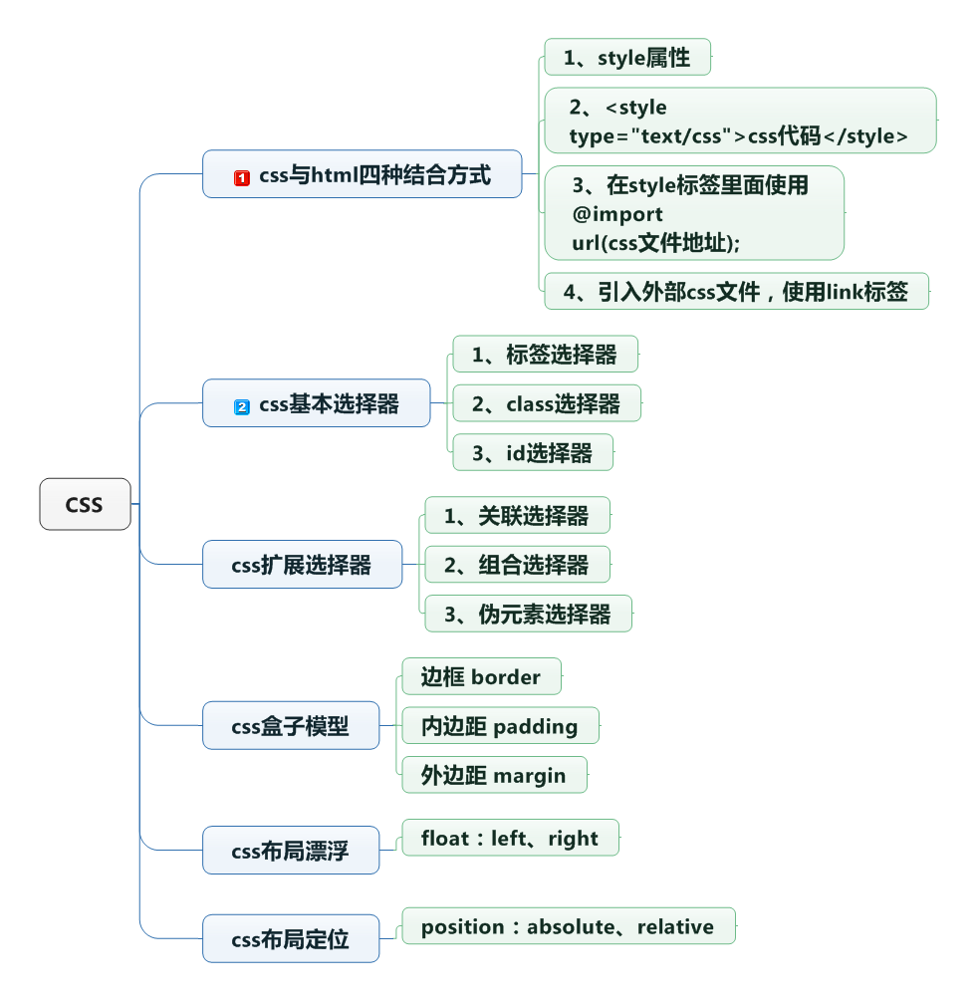
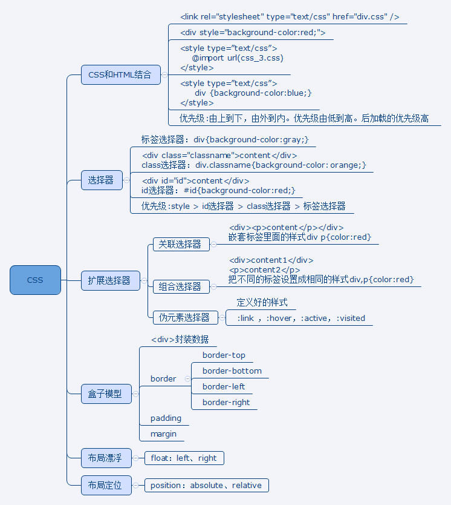

## 层叠样式表

CSS将网页内容和显示样式进行分离，提高了显示功能。





## HTML和CSS的结合方式

1.在每个html标签上面都有一个属性 style，把css和html结合在一起

```html
<div style="background-color:red;color:green;">
```

2.使用html的一个标签实现 `<style>`标签，写在head里面

```html
<style type="text/css">	
	div {
		background-color:blue;
		color: red;
	}		
</style>
```
3.在style标签里面使用语句（在某些浏览器下不起作用）@import url(css文件的路径);

```html
<style type="text/css">
	@import url(div.css);
</style>
```
4.使用头标签 link，引入外部css文件

```html
<link rel="stylesheet" type="text/css" href="css文件的路径" />
```

第3种结合方式，缺点：在某些浏览器下不起作用，一般使用第四种方式

## 样式优先级

由上到下，由外到内。优先级由低到高。后加载的优先级高

## 代码规范

格式

```
选择器名称 { 
	属性名:属性值;
	属性名:属性值;
	...
}
```

## 基本选择器

选择器：要对哪个标签里面的数据进行操作

### 标签选择器

使用标签名作为选择器的名称 

```css
div {
	background-color:gray;	
	color:white;
}
```

### class选择器

每个html标签都有一个class 属性

```html
<div class="haha">aaaaaaa</div>
```

```css
.haha {
	background-color: orange;
}
```

### id选择器

每个html标签上面有一个id属性

```html
<div id="hehe">bbbbb</div>
```

```css
#hehe {
	background-color: #333300;
}
```

### 优先级

style > id选择器 > class选择器 > 标签选择器

## 扩展选择器

### 关联选择器

```html
<div><p>hello</p></div>
```

设置div标签里面p标签的样式，嵌套标签里面的样式

```css
div p {	
	background-color: green;
}
```

### 组合选择器

```html
<div>1111</div>
<p>22222</p>
```

把div和p标签设置成相同的样式，把不同的标签设置成相同的样式

```css
div,p {
	background-color: orange;
}
```

### 伪元素选择器

浏览器的兼容性比较差，css里面提供了一些定义好的样式，可以拿过来使用，比如超链接的状态

- 原始状态:link
- 鼠标放上去状态:hover
- 点击:active
- 点击之后:visited	                          